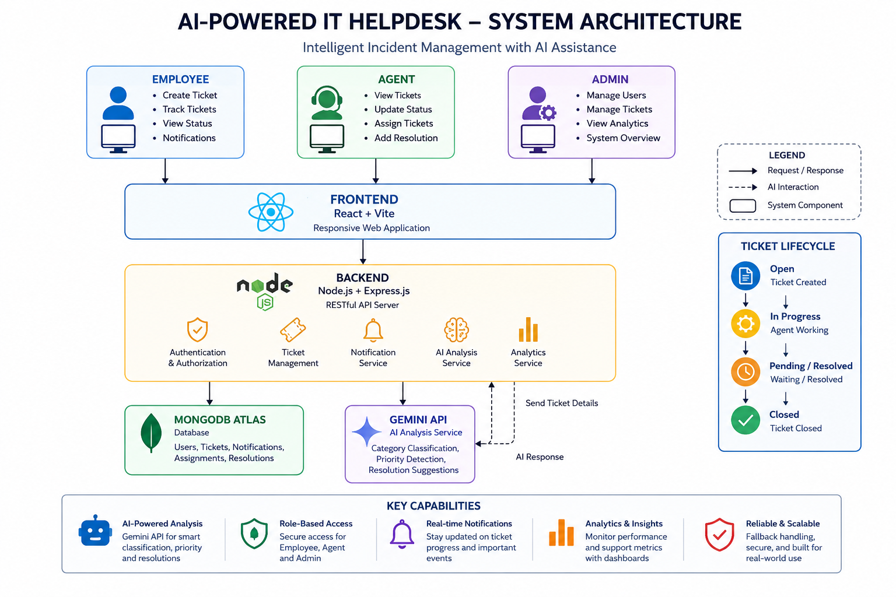

# 🤖 AI-Powered IT Helpdesk

### Intelligent Incident Management System

<p align="center">
  <b>AI-assisted IT incident management with role-based workflows, automated
  ticket analysis, notifications, and operational analytics.</b>
</p>

<p align="center">
  <a href="https://ai-it-helpdesk-frontend.onrender.com/">
    
  </a>
  <a href="https://github.com/aishna1206/AI-Powered-IT-Helpdesk-Intelligent-Incident-Management-System">
    
  </a>
</p>

---

## 📌 Overview

**AI-Powered IT Helpdesk** is an enterprise-style incident management
platform designed to centralize IT support operations and reduce manual
effort in ticket classification and resolution.

The system connects **Employees, Support Agents, and Administrators** through
a unified platform while using **Google Gemini** to assist with incident
classification, priority detection, and resolution recommendations.

### What the system provides

- 🎫 Centralized IT incident management
- 🤖 AI-assisted ticket analysis
- 🔐 Role-based authentication and authorization
- 👨‍💻 Employee, Agent, and Admin portals
- 🔔 Role-aware notifications
- 📊 Operational analytics
- 🗄️ MongoDB-backed persistence
- ☁️ Cloud deployment with Render

---

## 🏗️ System Architecture

<p align="center">
  
</p>

The application follows a **frontend → REST API → services/data layer**
architecture.

### High-Level Architecture

```text
┌───────────────────────────────────────────────────────────────┐
│                         USERS                                 │
│                                                               │
│  Employee                    Agent                 Admin       │
│     │                          │                     │         │
└─────┼──────────────────────────┼─────────────────────┼─────────┘
      │                          │                     │
      └──────────────────────────┼─────────────────────┘
                                 ▼
┌───────────────────────────────────────────────────────────────┐
│                    REACT + VITE FRONTEND                      │
│                                                               │
│  Dashboards • Tickets • Notifications • Analytics • Settings  │
└──────────────────────────────┬────────────────────────────────┘
                               │ REST API
                               ▼
┌───────────────────────────────────────────────────────────────┐
│                   NODE.JS + EXPRESS BACKEND                   │
│                                                               │
│  Authentication │ Ticket Management │ Notifications            │
│  AI Analysis    │ User Management   │ Analytics                │
└───────────────────────┬───────────────────────┬───────────────┘
                        │                       │
                        ▼                       ▼
             ┌───────────────────┐   ┌──────────────────────┐
             │   MongoDB Atlas   │   │      Gemini API      │
             │                   │   │                      │
             │ Users             │   │ Category             │
             │ Tickets           │   │ Priority             │
             │ Assignments       │   │ Resolution Suggestion│
             │ Resolutions       │   │                      │
             └───────────────────┘   └──────────────────────┘


             ┌──────────────────┐
             │ Employee creates │
             │     ticket       │
             └────────┬─────────┘
                      │
                      ▼
             ┌──────────────────┐
             │ Backend validates│
             │    request       │
             └────────┬─────────┘
                      │
                      ▼
             ┌──────────────────┐
             │   Gemini AI      │
             │ Incident Analysis│
             └────────┬─────────┘
                      │
            ┌─────────┴─────────┐
            │                   │
            ▼                   ▼
      ┌───────────┐       ┌─────────────┐
      │ AI result │       │ AI failure  │
      └─────┬─────┘       └──────┬──────┘
            │                    │
            │              Fallback analysis
            │                    │
            └──────────┬─────────┘
                       ▼
              ┌─────────────────┐
              │ Ticket stored   │
              │ in MongoDB      │
              └────────┬────────┘
                       │
                       ▼
              ┌─────────────────┐
              │ Agent reviews   │
              │ / assigns /     │
              │ updates ticket  │
              └────────┬────────┘
                       │
                       ▼
              ┌─────────────────┐
              │ Resolution      │
              │ added           │
              └────────┬────────┘
                       │
                       ▼
              ┌─────────────────┐
              │ Employee sees   │
              │ updated status  │
              └─────────────────┘

                    ┌───────┐
                    │  OPEN │
                    └───┬───┘
                        │
                        ▼
              ┌────────────────┐
              │  IN PROGRESS   │
              └───────┬────────┘
                      │
                  ┌───┴───────────┐
                  │               │
                  ▼               ▼
              ┌─────────┐     ┌───────────┐
              │ PENDING │     │  RESOLVED │
              └────┬────┘     └─────┬─────┘
                  │                │
                  └───────┬────────┘
                          ▼
                      ┌──────────┐
                      │  CLOSED  │
                      └──────────┘


## 👥 User Roles
** Role	            Responsibilities**

👤 Employee	     Create tickets, track incidents, view resolutions, receive notifications
🎧 Agent	       Review incidents, assign tickets, update status, add resolutions
🛡️ Admin	        Manage tickets and users, monitor analytics, oversee support operations


## 🤖 AI-Assisted Incident Analysis

Gemini acts as an assistive intelligence layer rather than replacing the
support team.

For each new incident, the backend attempts to determine:

AI Output	Purpose

Category	Classifies the incident type
Priority	Estimates support urgency
Suggested Resolution	Provides an initial troubleshooting recommendation


Example:
Employee submits:
"Unable to connect my laptop to office Wi-Fi."

                ↓

Gemini Analysis

Category:
Network

Priority:
Medium

Suggested Resolution:
Verify network credentials, restart the network adapter,
and reconnect to the corporate network.

                   Ticket
                     │
                     ▼
              Gemini Analysis
                     │
              ┌──────┴──────┐
              │             │
           Success         Failure
              │             │
              ▼             ▼
        AI classification  Fallback
              │             │
              └──────┬──────┘
                     ▼
             Ticket is created

## 🔐 Authentication & Security

The application uses JWT-based authentication combined with
role-based authorization.
 
 Login
  │
  ▼
Credential validation
  │
  ▼
JWT issued
  │
  ▼
Authenticated API requests
  │
  ▼
Role verification
  │
  ├──────── Employee Portal
  ├──────── Agent Portal
  └──────── Admin Portal

  ## 🧰 Technology Stack
**Layer	             Technologies**
Frontend          React, Vite, React Router
UI Icons          Lucide React
Backend	          Node.js, Express.js
Database          MongoDB Atlas, Mongoose
AI	              Google Gemini API, @google/genai
Authentication    JWT, bcrypt
Deployment        Render